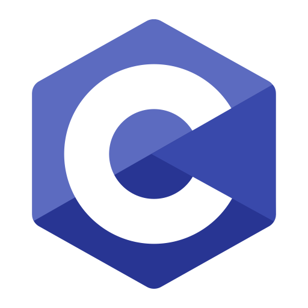
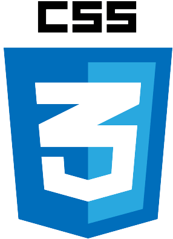
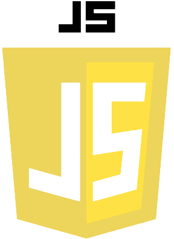
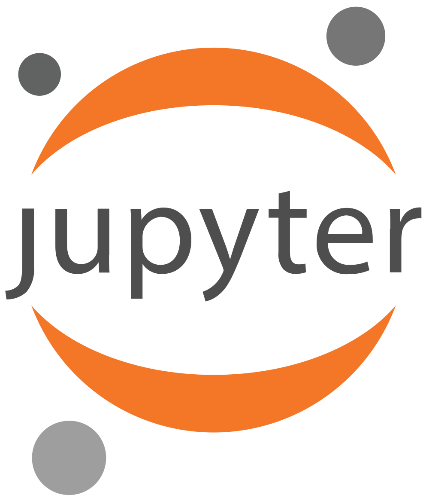

<h1 align="center">Hi there, I'm Akarsh </h1>
<h3 align="center">I'm a passionate about AI | ML and a  Final Year B.Tech student of Sharad Institute of Technology and College of Engineering, Yadrav</h2>

- 🌱 I’m currently learning **Machine Learning**
  
- 💬 Ask me about - **Python, Java, Data Science, ML, GenAI **
  
- 👨‍💻 Want to know more? Check out my [portfolio](https://akarshvante.netlify.app/)
  
- 📫 How to reach me - **akarshvante@gmail.com**
  
- 👨‍💻 Intrested in - **Competative Programming, Web-Development, Machine Learning, Data Science**

- ⚡Fun Fact - **I'm also a good Chess Player, [Challenge Me](https://www.chess.com/member/akarshvante)**

  

## ✨ Skills

- Python, Java, JavaScript
- Data Science
- Machine Learning

## My Languages and Tools:

  
<!--    -->
  
  
  
  
  
<!--   
  
   -->
  
<!--    -->
  
  
  
  

## 💻 My Best Projects

- [GeminiVision](https://geminivisionai.streamlit.app/)
- [RAGChat – Multi-Document Q&A Bot ](https://pdf-chat-app-system.streamlit.app/)
- [Sales BI Dashboard — Executive Sales Analytics](https://bi-report.streamlit.app/)
- [more projects...](https://github.com/AkarshVante?tab=repositories)

## 📞 Contact Me

<a href="https://www.linkedin.com/in/akarshvante/" target="_blank">

<!-- </a>
  -->

### 💻 My Github Logs

  
  

